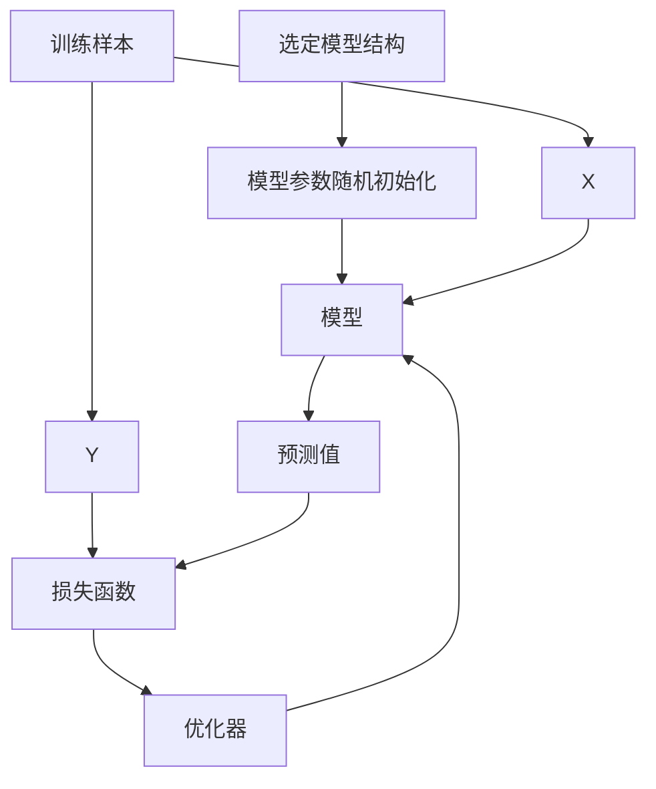

# 深度学习



输入（特征）--->线性运算 Wx + b --->激活函数（tanh / ReLU / GELU）-->隐藏层……（重复很多次）

--->输出层（一般用 Softmax）--->Loss（交叉熵 / MSE）--->反向传播（根据 Loss 求梯度）

--->优化器更新参数（SGD / Adam）

## 网络结构-全连接层

又称线性层

计算公式：y =xA^T+b ---> 也可以是 wx+b T 指的是矩阵的转置 知道这是矩阵 b 是向量可有可无

A 和 b 是参与训练的参数（很多时候称为 w 和 b）

A 的维度决定了输出的维度

举例

输入：x （1 ×3）的向量 [0,1,2]

A 是 5 乘 3 的矩阵 转置就是 3 乘 5 3 是输入决定的

b 是 1 × 5

X\*A^T （1 ×3）（3×5） 输出形状就是 1×5

XA^T+b 结果还是 1×5

## 激活函数

为模型添加非线性因素，使模型更具有拟合非线性函数的能力

如果没有激活函数，整个神经网络就变成一个大号“线性函数”，无论堆多少层仍然只能表示直线，表达能力极弱。

### Sigmoid 函数

$$
\sigma(x) = \frac{1}{1 + e^{-x}} \\
\\上（分子）：f(x) = 1; f'(x) = 0;
\\下（分母）：g(x) = 1 + e^{-x}就是对e^{-x}采用链式法则求导 	\\
\\外层函数：f(u) = e^u ,f'(u) = e^u ;  内层函数：u(x) = -x ,u'(x) = -1
\\链式法则公式：\frac{d}{dx} f(u(x)) = f'(u(x)) \cdot u'(x)
\\\frac{d}{dx} e^{-x}求导过程【外层先导，把u是-x带入，再乘内层导数】结果：  e^{-x} \cdot (-1)
\\g'(x) = \frac{d}{dx}(1 + e^{-x}) = -e^{-x}
\\然后使用商法则来求导,(上导*下 − 上*下导) / 下²,
\sigma'(x) = \frac{f'(x)\cdot g(x) - f(x)\cdot g'(x)}{[g(x)]^2}\\
\sigma'(x) = \frac{0 \cdot (1+e^{-x}) - 1 \cdot (-e^{-x})}{(1+e^{-x})^2}\\
化简：\sigma'(x) = \frac{e^{-x}}{(1 + e^{-x})^2}\\
与原函数联系,
两边都1减：\sigma(x) = \frac{1}{1+e^{-x}}\\1 - \sigma(x) = \frac{1+e^{-x}}{1+e^{-x}} - \frac{1}{1+e^{-x}}, \quad 1-\sigma(x) = \frac{e^{-x}}{1+e^{-x}}
\\
\sigma'(x) = \sigma(x) \cdot (1 - \sigma(x))
$$

它把任意实数输入映射到区间 **(0,1)**

igmoid 的图像是一条 S 型曲线：

- 当 x → +∞ 时，输出 → 1
- 当 x → −∞ 时，输出 → 0
- 在 x = 0 处，σ(0) = 0.5

这使它非常适合表示“概率”

二分类任务的输出层（最经典用途） 例如，判断一张图是否是“猫”

**为什么 Sigmoid 像“概率”**

因为：

- 输出严格在 0 ～ 1 之间
- 随输入增加平滑上升
- 对称、连续、单调递增
- 导数结构像“概率 × (1-概率)”

### tanh 函数

$$
tanh(x) = \frac{e^x - e^{-x}}{e^x + e^{-x}}
$$

**特点**

- 对称于 0（比 sigmoid 更好）
- 大输入 → 输出接近 ±1，梯度变小（梯度消失）

**常用场景**

- RNN（较早期）
- 输入特征中心化需要在 -1~1

### Relu 函数（最常用）

$$
ReLU(x) = \max(0, x)
$$

**特点**

- 简单、计算快
- x>0 线性，x<0 为 0
- 不会像 sigmoid / tanh 那样饱和
- 现代深度学习默认首选激活函数

**缺点：ReLU 死亡 ReLU 问题**

如果权重更新导致神经元长期输出 < 0，则永远输出 0，无法恢复。

### Gelu 函数（Transformer 默认激活）

$$
GELU(x) \approx x \cdot \sigma(1.702x)
$$

**直观理解**

与 ReLU 不同：

- ReLU 是“硬切分”：负数直接清零
- GELU 是“软选择”：
  输入越大，越有可能保留；输入越小，越可能被削弱

它使用高斯分布“概率地保留输入”。

**特点**

- 更平滑，不会像 ReLU 那样突然“截断”
- Transformer（BERT、GPT）普遍使用

### Softmax 函数（分类任务必备）

Softmax 把一组数字转换为概率分布

$$
Softmax(z_i)= \frac{e^{z_i}}{\sum_{j=1}^C e^{z_j}}
$$

**特点**

- 输出范围 0~1
- 输出之和 = 1
- 常用于多分类问题（如 10 分类、1000 分类）

Softmax 会把最大的数强化成接近 1，其他变得更小。

## 损失函数

### 均方差（mean square error）

常用于回归任务

$$
MSE = \frac{1}{N}\sum_{i=1}^{N}(y_i - \hat{y}_i)^2
$$

**特点**

- 更适合预测连续值（温度、房价）
- 会放大大的误差（平方）

### 交叉熵（CrossEntropy ）

分类任务最重要的损失函数。

Softmax + CrossEntropy = 标配

**二分类**

$$
L = -[ y\ln(p) + (1-y)\ln(1-p) ]
$$

**多分类**

真实标签（例如类别 2）
↓
转换成 One-Hot： [0,1,0] 结合代码去理解

例如 y = [0,0,1,0]

预测为概率分布：

例如 p = [0.1, 0.2, 0.6, 0.1]

交叉熵公式：

$$
L = -\sum_{i=1}^{C} y_i \ln(p_i)
$$

**直觉**

- 预测正确 → 概率 p 大 → 损失接近 0
- 预测错误 → p 接近 0 → -log(p) 非常大（惩罚严重）

## 分类任务

分类任务就是：给模型一个输入，让它判断“属于哪个类别”

例如：识别图片里是不是猫，判断邮件是不是垃圾邮件，判定用户是不是会流失，预测文本表达的情绪

| 概念                 | 含义                     |
| -------------------- | ------------------------ |
| logits               | 模型输出的原始分数       |
| softmax              | 把分数转成概率           |
| sigmoid              | 二分类的概率函数         |
| 交叉熵 loss          | 比较预测分布与真实分布   |
| 梯度下降             | 让损失变小的优化方向     |
| 隐含层/权重          | 模型内部的数学运算结构   |
| 训练集/验证集/测试集 | 模型训练和评估的数据划分 |

**流程**

数据 →（预处理）→ 模型（MLP/CNN/Transformer 等）

→ logits → softmax → 损失 → 反向传播 → 更新参数 → 完成训练

# 数学基础

## 标量（Scalar）

标量就是一个单独的数。  
例如：1、3.14、-5

---

## 向量（Vector）

向量是一维数组，通常表示为列向量：

$$
\begin{bmatrix}
x_1 \\
x_2 \\
\vdots \\
x_n
\end{bmatrix}
$$

向量可理解为空间中的点，每个元素对应不同坐标轴的坐标。

向量中有多少个元素，就叫几维向量。

例如：

$$
[1,2,3,4]
$$

---

### 向量加法

要求两个向量维度相同。

交换律：

$$
A + B = B + A
$$

示例：

$$
[1,2] + [3,4] = [4,6]
$$

---

### 向量内积（点积）

要求两个向量维度相同。

定义：

$$
A \cdot B = x_1 y_1 + x_2 y_2 + \cdots + x_n y_n
$$

交换律：

$$
A \cdot B = B \cdot A
$$

示例：

$$
[1,2] \cdot [3,4] = 1 \cdot 3 + 2 \cdot 4 = 11
$$

---

### 向量的模（长度）

定义：

$$
\|A\| = \sqrt{x_1^2 + x_2^2 + \cdots + x_n^2}
$$

---

### 向量夹角的余弦值

要求两个向量维度相同。

定义：

$$
\cos \theta = \frac{A \cdot B}{\|A\| \cdot \|B\|}
$$

---

## 矩阵（Matrix）

矩阵是一个二维数组，每个元素为标量，可通过行号和列号索引。

---

### 矩阵加法

要求两个矩阵维度相同。

$$
\begin{bmatrix}
1 & 2\\
3 & 4
\end{bmatrix}
+
\begin{bmatrix}
4 & 2\\
3 & 1
\end{bmatrix}
=
\begin{bmatrix}
5 & 4\\
6 & 5
\end{bmatrix}
$$

---

### 矩阵乘法（点积矩阵乘法）

**前提**

左矩阵 A 的列数等于右矩阵 B 的行数

设：

$$
A=\begin{pmatrix}
a & b \\
c & d
\end{pmatrix},
\quad
B=\begin{pmatrix}
e & f \\
g & h
\end{pmatrix}
$$

则：

$$
A \times B =
\begin{pmatrix}
ae+bg & af+bh \\
ce+dg & cf+dh
\end{pmatrix}
$$

$$
A=
\begin{pmatrix}
a&b&c\\d&e&f\\g&h&i
\end{pmatrix},\quad
B=
\begin{pmatrix}
j&k&l\\m&n&o\\p&q&r
\end{pmatrix}


AB =
\begin{pmatrix}
aj+bm+cp & ak+bn+cq & al+bo+cr \\
dj+em+fp & dk+en+fq & dl+eo+fr \\
gj+hm+ip & gk+hn+iq & gl+ho+ir
\end{pmatrix}
$$

矩阵 A 是 2 行 3 列 2×3

```
| 1  2  3 |
| 4  5  6 |
```

矩阵 B 是 3 行 2 列 3×2

```
| 1  2 |
| 3  4 |
| 5  6 |
```

结果 C= A × B = 2×2

计算过程：

```
第 1 行 × 第 1 列：     1*1 + 2*3 + 3*5 = 1 + 6 + 15 = 22
第 1 行 × 第 2 列：     1*2 + 2*4 + 3*6 = 2 + 8 + 18 = 28
第 2 行 × 第 1 列：     4*1 + 5*3 + 6*5 = 4 + 15 + 30 = 49
第 2 行 × 第 2 列：     4*2 + 5*4 + 6*6 = 8 + 20 + 36 = 64
最终结果：
| 22  28 |
| 49  64 |
```

**性质**

不满足交换律：

$$
A \cdot B \ne B \cdot A
$$

满足分配律：

$$
A(B + C) = AB + AC
$$

满足结合律：

$$
A(BC) = (AB)C
$$

---

### Hadamard 乘法（逐元素乘）

要求两个矩阵形状一致。

示例：

$$
\begin{bmatrix}
1 & 2 \\
3 & 4
\end{bmatrix}
\circ
\begin{bmatrix}
1 & 2 \\
0 & -1
\end{bmatrix}
=
\begin{bmatrix}
1 & 4 \\
0 & -4
\end{bmatrix}
$$

---

### 矩阵转置（Transpose）

行列互换。

$$
\begin{bmatrix}
1 & 2 \\
3 & 4
\end{bmatrix}^T
=
\begin{bmatrix}
1 & 3 \\
2 & 4
\end{bmatrix}
$$

例如：

$$
3 \times 2 \rightarrow 2 \times 3
$$

---

### 向量与矩阵转换

**reshape**

$$
[1,2,3,4]
\rightarrow
\begin{bmatrix}
1 & 2\\
3 & 4
\end{bmatrix}
$$

$$
[1,2,3,4,5,6]
\rightarrow
\begin{bmatrix}
1 & 2\\
3 & 4\\
5 & 6
\end{bmatrix}
$$

---

**flatten**

$$
\begin{bmatrix}
1 & 2\\
3 & 4\\
5 & 6
\end{bmatrix}
\rightarrow
[1,2,3,4,5,6]
$$

---

## 张量（Tensor）

矩阵是二维，张量是多维数据结构。

示例：

3 个 2×2 矩阵：

$$
3\times2\times2
$$

4 个 3×2×2 张量：

$$
4\times3\times2\times2
$$

在深度学习中，输入、输出、中间结果几乎都是张量。

---

## 导数(Derivative）

- 如果函数是位置，导数就是速度

- 如果函数是距离变化，导数就是变化速度

- 函数曲线上某点的导数 = 该点切线斜率

- 变化方向（正增长还是负增长）

- 变化快慢（增长多快）

- 曲线斜率（图像有多陡）

如果没有导数，你看不出未来趋势。
有了导数，你能预测变化、做优化、画切线、做智能算法。

$$
f'(x_0) = \lim_{\Delta x \to 0} \frac{f(x_0 + \Delta x) - f(x_0)}{\Delta x}
$$

> 函数在某个点 x 下标 0 的导数，就是函数值变化量与自变量变化量的比值，当变化量趋于无穷小

🧠 导数的直观理解（速度类比）

想象你站在某条路上的一个位置：

$$
x_0
$$

你想知道此刻你的 **瞬时速度**（也就是导数）。

你不能直接问“现在速度是多少”，  
因为你只知道 **位置**，不是 **速度**

🚶‍♂️ 1. 走一点点距离

向前走一小段距离：

$$
\Delta x
$$

📏 2. 看位置变化多少

计算位置的变化：

$$
f(x_0 + \Delta x) - f(x_0)
$$

⏳ 3. 求平均速度

平均速度 = 路程变化 / 时间变化：

$$
\frac{f(x_0 + \Delta x) - f(x_0)}{\Delta x}
$$

⚡ 4. 但我们要的是“瞬时速度”！

平均速度不够，我们想知道 **这一瞬间的速度**！

怎么办？

让这段“时间”越来越短：

$$
\Delta x \to 0
$$

🚀 5. 当时间趋近 0，平均速度变成瞬时速度

于是得到：

$$
f'(x_0) = \lim_{\Delta x \to 0}
\frac{f(x_0 + \Delta x) - f(x_0)}{\Delta x}
$$

### **幂函数求导**

$$
公式：(x^n)' = n x^{n-1}  \\

案例：f(x) = x^2 求导\\
解：f'(x)=2x
$$

### **常数求导**

$$
公式：(c)' = 0\\

案例：f(x)=5 \\
不管怎么移动 x，y 都不变,没变化 → 变化速度=0\\
解：f′(x)=0
$$

### **线性函数求导**

$$
公式：(ax+b)' = a\\

案例：f(x)=3x+1\\
线性函数求导=斜率\\
解：f'(x)=3
$$

### **乘积法则**

$$
公式：(f(x)g(x))'=f'(x)g(x)+f(x)g′(x)\\

案例：f(x)=x,g(x)=x^2\\
前导后不导 + 前不导后导\\
解：(x⋅x^2)'\\
(x⋅x2)'=1⋅x^2+x⋅2x\\
化简：(x⋅x2)'=x^2+2x^2=3x^2 \\
$$

### **商法则**

$$
公式：\left(\frac{f(x)}{g(x)}\right)'
= \frac{f'(x)g(x)-f(x)g'(x)}{[g(x)]^2} \\

\text{求导：}\quad
\left(\frac{x}{x^2}\right)'\\

f(x)=x,\; g(x)=x^2,\quad
f'(x)=1,\; g'(x)=2x \\

\text{代入商法则：}\quad
\left(\frac{x}{x^2}\right)'
=
\frac{f'(x)g(x)-f(x)g'(x)}{[g(x)]^2}

=\\(上导*下 − 上*下导) / 下²\\
\frac{1\cdot x^2 - x\cdot 2x}{(x^2)^2}

=
\frac{x^2 - 2x^2}{x^4}

=
\frac{-x^2}{x^4}

=
-\frac{1}{x^2}
$$

### **链式法则**

$$
公式：\left(f(g(x))\right)' = f'(g(x))\cdot g'(x)\\

案例：y = (3x+1)^2\\


外层f(u)=u^2,\quad 内层u=3x+1\\
外层先导，把u是内层带进去，再乘内层导数\\
f'(u)=2u,\quad u'=3\\y' = 2(3x+1)\cdot 3\\
y' = 6(3x+1)，y' = 18x+6，y' = 18x+6\\
$$

## 补充

### numpy

numpy 常用操作 来定义矩阵 调用里面的方法

前置

```python
import numpy as np
```

| 方法                  | 示例                            | 说明               |
| --------------------- | ------------------------------- | ------------------ |
| `np.array()`          | `np.array([1,2,3])`             | 从 Python 列表创建 |
| `np.zeros()`          | `np.zeros((2,3))`               | 创建全 0 矩阵      |
| `np.ones()`           | `np.ones((3,3))`                | 创建全 1 矩阵      |
| `np.eye()`            | `np.eye(3)`                     | 单位矩阵           |
| `np.full()`           | `np.full((2,2),7)`              | 指定值填充         |
| `np.arange()`         | `np.arange(0,10,2)`             | 生成等差序列       |
| `np.linspace()`       | `np.linspace(0,1,5)`            | 生成等间隔序列     |
| `np.random.rand()`    | `np.random.rand(2,3)`           | 0~1 均匀分布随机数 |
| `np.random.randn()`   | `np.random.randn(2,3)`          | 标准正态分布       |
| `np.random.randint()` | `np.random.randint(0,10,(2,2))` | 随机整数矩阵       |

#### **矩阵运算**

| 方法             | 示例       | 说明             |
| ---------------- | ---------- | ---------------- |
| 加法             | `A + B`    | 按元素           |
| 减法             | `A - B`    | 按元素           |
| 乘法（逐元素）   | `A * B`    | 向量化操作       |
| 点乘（矩阵乘法） | `A.dot(B)` | 或 `np.dot(A,B)` |
| 点乘（运算符）   | `A @ B`    | 同矩阵乘法       |
| 幂               | `A ** 2`   | 每个元素平方     |
| 取反             | `-A`       | 每个元素取负     |

示例：

```python
A = np.array([[1,2],[3,4]])
B = np.array([[5,6],[7,8]])
C = A @ B
```

#### 常用数学函数

| 函数         | 示例            | 说明     |
| ------------ | --------------- | -------- |
| `np.sum()`   | `np.sum(A)`     | 求和     |
| `np.mean()`  | `np.mean(A)`    | 均值     |
| `np.max()`   | `np.max(A)`     | 最大值   |
| `np.min()`   | `np.min(A)`     | 最小值   |
| `np.std()`   | `np.std(A)`     | 标准差   |
| `np.sqrt()`  | `np.sqrt(A)`    | 开根号   |
| `np.exp()`   | `np.exp(A)`     | e^x      |
| `np.log()`   | `np.log(A)`     | ln(x)    |
| `np.sin()`   | `np.sin(A)`     | 正弦     |
| `np.cos()`   | `np.cos(A)`     | 余弦     |
| `np.abs()`   | `np.abs(A)`     | 绝对值   |
| `np.round()` | `np.round(A,2)` | 保留小数 |

#### **矩阵属性**

| 表达式    | 说明     |
| --------- | -------- |
| `A.shape` | 形状     |
| `A.ndim`  | 维度     |
| `A.size`  | 元素总数 |
| `A.dtype` | 数据类型 |
| `A.T`     | 转置     |
| `A.real`  | 实部     |
| `A.imag`  | 虚部     |

---

#### 形状操作（Reshape / Flatten）

| 方法          | 示例             | 说明           |
| ------------- | ---------------- | -------------- |
| `reshape()`   | `A.reshape(3,2)` | 改形状         |
| `flatten()`   | `A.flatten()`    | 展平为 1D      |
| `ravel()`     | `A.ravel()`      | 展平（更快）   |
| `resize()`    | `A.resize(2,3)`  | 直接修改原数组 |
| `transpose()` | `A.transpose()`  | 转置           |

示例：

```python
A = np.array([[1,2],[3,4],[5,6]])
A.reshape(2,3)
```

---

#### 索引操作

普通索引

```python
A[0,1]     # 第一行第二列
A[:,1]     # 所有行，第2列
A[1,:]     # 第2行，所有列
A[0:2, :]  # 前两行
```

布尔索引

```python
A[A > 0]
```

---

#### 拼接操作（Concatenate / Stack）

| 方法               | 示例                            | 说明         |
| ------------------ | ------------------------------- | ------------ |
| `np.concatenate()` | `np.concatenate([A,B], axis=0)` | 合并数组     |
| `np.hstack()`      | `np.hstack([A,B])`              | 水平拼接     |
| `np.vstack()`      | `np.vstack([A,B])`              | 垂直拼接     |
| `np.stack()`       | `np.stack([A,B], axis=0)`       | 新增维度堆叠 |

---

#### 线性代数

| 方法                | 示例                   | 说明             |
| ------------------- | ---------------------- | ---------------- |
| `np.linalg.inv()`   | `np.linalg.inv(A)`     | 逆矩阵           |
| `np.linalg.det()`   | `np.linalg.det(A)`     | 行列式           |
| `np.linalg.eig()`   | `np.linalg.eig(A)`     | 特征值、特征向量 |
| `np.linalg.norm()`  | `np.linalg.norm(A)`    | 范数             |
| `np.linalg.solve()` | `np.linalg.solve(A,b)` | 解方程：Ax=b     |

示例：

```python
A = np.array([[1,2],[3,4]])
inv = np.linalg.inv(A)
```

---

#### 随机模块

| 方法                  | 示例                            | 说明         |
| --------------------- | ------------------------------- | ------------ |
| `np.random.seed()`    | `np.random.seed(0)`             | 设置随机种子 |
| `np.random.rand()`    | `np.random.rand(2,3)`           | 均匀分布     |
| `np.random.randn()`   | `np.random.randn(2,3)`          | 正态分布     |
| `np.random.randint()` | `np.random.randint(0,10,(2,2))` | 随机整数     |
| `np.random.shuffle()` | `np.random.shuffle(A)`          | 原地洗牌     |

---

#### 类型转换

| 方法       | 示例                   | 说明         |
| ---------- | ---------------------- | ------------ |
| `astype()` | `A.astype(np.float32)` | 转换数据类型 |

---

#### 读写文件

| 方法           | 示例                    | 说明       |
| -------------- | ----------------------- | ---------- |
| `np.save()`    | `np.save('a.npy',A)`    | 保存二进制 |
| `np.load()`    | `np.load('a.npy')`      | 读取二进制 |
| `np.savetxt()` | `np.savetxt('a.txt',A)` | 保存文本   |
| `np.loadtxt()` | `np.loadtxt('a.txt')`   | 读取文本   |

---

#### 常见小技巧

1. 快速生成单位矩阵

```python
np.eye(4)
```

2. 生成一个 10x10 的随机矩阵

```python
np.random.randn(10,10)
```

3. 快速查看数据统计信息

```python
A.min(), A.max(), A.mean(), A.std()
```

4. 比较两个矩阵是否相等

```python
np.allclose(A, B)
```

---

**总结一句话：**

NumPy = 快速创建数组 + 高效向量运算 + 线性代数工具箱

相比纯 Python：更快、更简洁、更数学化
